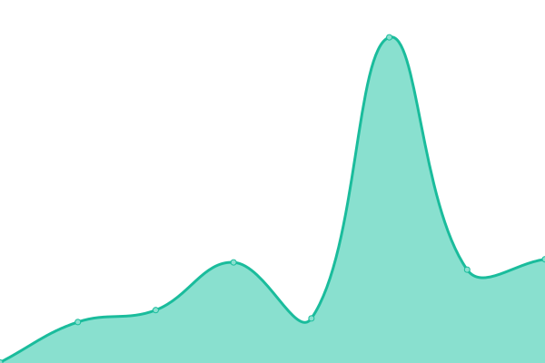
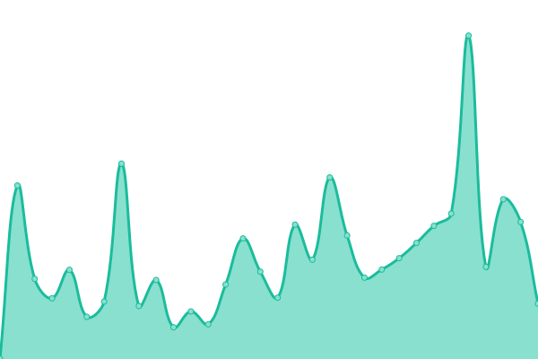

# [📈 Live Status](https://status.hearty.me): <!--live status--> **🟧 Partial outage**

This repository contains the open-source uptime monitor and status page for [Nien Chen](https://www.nien.com), powered by [Upptime](https://github.com/upptime/upptime).

With [Upptime](https://upptime.js.org), you can get your own unlimited and free uptime monitor and status page, powered entirely by a GitHub repository. We use [Issues](https://github.com/chennien/status.hearty.me/issues) as incident reports, [Actions](https://github.com/chennien/status.hearty.me/actions) as uptime monitors, and [Pages](https://status.hearty.me) for the status page.

<!--start: status pages-->
<!-- This summary is generated by Upptime (https://github.com/upptime/upptime) -->
<!-- Do not edit this manually, your changes will be overwritten -->
<!-- prettier-ignore -->
| URL | Status | History | Response Time | Uptime |
| --- | ------ | ------- | ------------- | ------ |
|  [溫度日記 Hearty Journal](https://hearty.me/robots.txt) | 🟩 Up | [hearty-journal.yml](https://github.com/chennien/status.hearty.me/commits/HEAD/history/hearty-journal.yml) | 

 209ms
     
 | 

<a href="https://status.hearty.me/history/hearty-journal">100.00%</a>
    

|  [短網址 URL Shortener](https://go.hearty.me/favicon.ico) | 🟩 Up | [url-shortener.yml](https://github.com/chennien/status.hearty.me/commits/HEAD/history/url-shortener.yml) | 

 159ms
     
 | 

<a href="https://status.hearty.me/history/url-shortener">100.00%</a>
    

|  [陳年 Nien 진년](https://www.nien.com/robots.txt) | 🟥 Down | [nien.yml](https://github.com/chennien/status.hearty.me/commits/HEAD/history/nien.yml) | 

 377ms
     
 | 

<a href="https://status.hearty.me/history/nien">98.30%</a>
    

<!--end: status pages-->

[**Visit our status website →**](https://status.hearty.me)

## 📄 License

- Powered by: [Upptime](https://github.com/upptime/upptime)
- Code: [MIT](./LICENSE) © [Nien Chen](https://www.nien.com)
- Data in the `./history` directory: [Open Database License](https://opendatacommons.org/licenses/odbl/1-0/)
